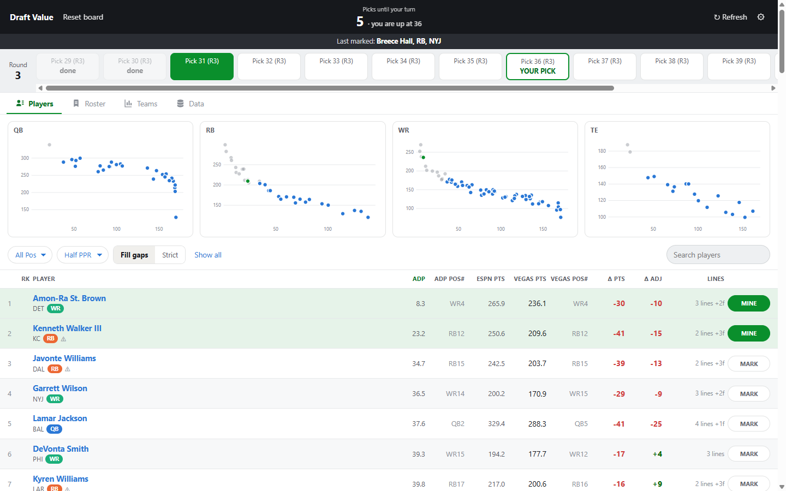
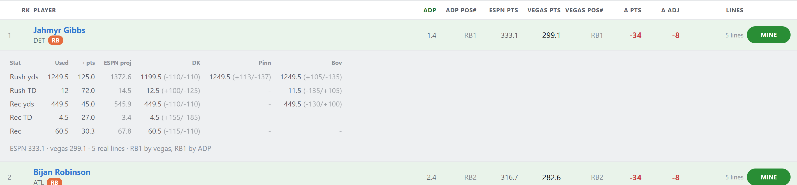
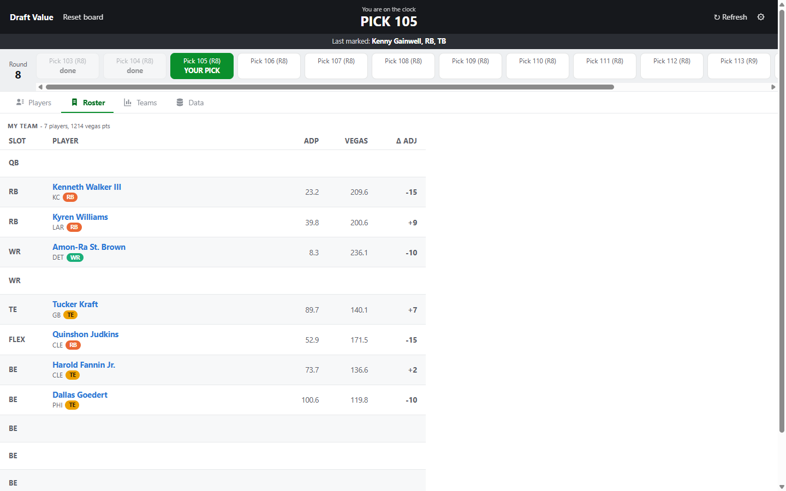
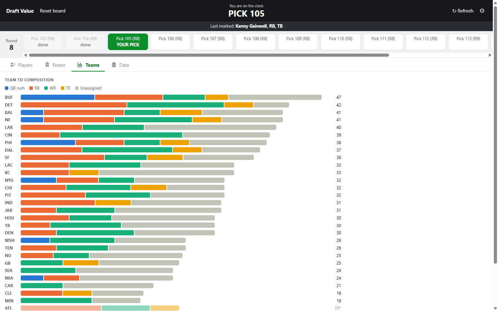
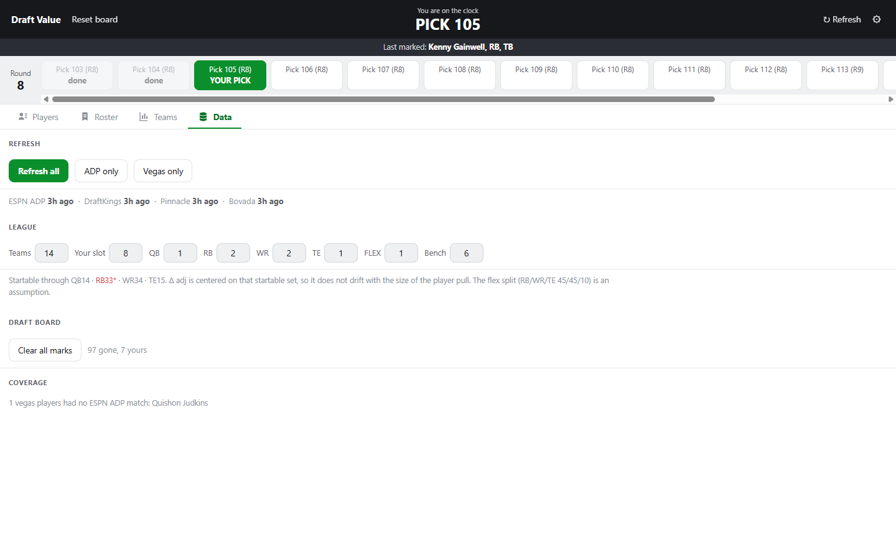

# Draft Value

This is a locally run draft board for fantasy football that prices players against
sportsbook lines instead of arbitrary app rankings. It pulls ESPN's average draft position and
season-long player props from DraftKings, Pinnacle, and Bovada, converts the props into
implied fantasy points under your scoring, and shows where the draft market and the
betting market disagree. Runs entirely on your own machine. Nothing is sent anywhere
except the read-only requests to ESPN and the three books.



*Two picks into a half-PPR draft from slot 4. Gibbs and Bijan Robinson are gone, struck
through in the table and greyed in the scatters. The green rule is the divider marking
your next pick, and it sits directly under Ja'Marr Chase because exactly one available
player is expected off the board before your turn. Screenshots show different drafts at
different points and are not meant to reconcile across images.*

## What it does

- Converts each posted O/U line into fantasy points: 0.04/pass yd, 4/pass TD, 0.1/rush
  and rec yd, 6/rush and rec TD, and receptions at 1, 0.5, or 0 depending on scoring.
  Where more than one book posts a stat, the aggregate is the median line.
- Ranks players by implied points **within position**, so a QB's total is never compared
  against a running back's.
- Reports two different disagreements. **Delta pts** is vegas minus ESPN's projection,
  summed only over stats where a real book line exists. **Delta adj** re-centres that on
  the median of startable players, which is the number worth reading.
- Tracks the draft as it happens. Mark a player gone and the countdown, the pick carousel,
  and the green divider showing where your next pick lands all move with it.
- Lays your own picks into your league's starter slots, flex and bench included, with
  each player's ADP, implied points, and delta adj.
- Breaks down market-implied touchdowns per team by scoring position, including the
  scores the market implies but assigns to nobody it prices.
- Refreshes each source on demand and stamps every one with its age. Nothing expires on
  its own and nothing updates behind your back.

## Why delta adj rather than delta pts

ESPN's projections run roughly 25 to 45 points hot against vegas medians across the whole
board. The books price missed games; ESPN projects full seasons and has no constraint
forcing the projections to add up to what offenses actually produce. That bias is uniform
enough to be noise rather than signal, so the raw gap says little.

Delta adj subtracts the position's median gap, leaving the disagreement specific to one
player. It centres on **startable** players only, not the whole scraped pool, because a
median over everyone moves when you change how many players you pull, which would make
the metric drift with a setting that has nothing to do with football.

### Expand a player

Click any row for the per-stat breakdown: which line was used, what it contributes in
points, ESPN's projection for the same stat, and each book's line with its odds.



*Jahmyr Gibbs, one of the few players with a real line on all five stats. DraftKings has
his rushing yards at 1199.5 while Pinnacle and Bovada both post 1249.5, so the median
takes 1249.5. His rushing TD resolves to 12 from DraftKings' 12.5 and Bovada's 11.5, with
Pinnacle not posting one at all. ESPN projects 333.1 points against vegas at 299.1.*

### Track the draft

Mark a player **GONE** as he is taken, or **MINE** when you take him. Marks are the only
input the pick maths uses: picks made equals marks, so the header countdown, the carousel,
and the divider all follow from keeping the board current.

The divider in the first screenshot is placed by counting available players, not by
position on screen: one pick until your turn puts it under exactly one unmarked player.
It appears only on the ascending ADP sort. "These players go before your turn" is a claim
about draft order, and drawing a confident green line at an arbitrary spot in a
delta-sorted list would be worse than drawing nothing.

### Roster



*A filled 15-man roster in a two-FLEX league. Delta adj is carried per player: McBride at
+13 is the one vegas rates well above ESPN relative to other tight ends, while McCaffrey
at -18 is the books pricing in missed games that ESPN's projection does not.*

### Team touchdowns



*A passing TD and its receiving TD are the same score, so they are counted once. Team
total is the QB's passing-TD line plus rushing TDs from players who have one.*

The **Unassigned** segment is the gap between a QB's passing-TD line and the sum of his
listed pass-catchers' receiving-TD lines. Those are scores the market implies exist but
assigns to nobody it prices. Read it as an uncertainty flag on a fragmented receiving
corps, not as a buy signal, since it partly reflects which players the books decline to
post at all.

## Setup

Requires **Python 3.11+**.

```bash
python -m venv .venv
.venv\Scripts\pip install -r requirements.txt
```

Then `run.bat`, or:

```bash
.venv\Scripts\python -m uvicorn app.main:app --port 8642
```

Open <http://localhost:8642> and press **Refresh** before you rely on anything. The
repository ships with no data.

## Configure your league first

Everything on the Data tab persists to browser storage. Defaults are a 14-team half-PPR
league drafting from slot 8.



- **Teams** and **your slot** drive the snake maths. Get the slot wrong and the countdown
  and the divider are wrong together.
- **Starter slots and bench** define the roster layout and the replacement level that
  delta adj centres on.
- The **flex split** behind replacement level is fixed at RB 45% / WR 45% / TE 10%. It is
  an assumption, not a measurement, and it moves where the startable line falls.

The Data tab prints the resulting startable cutoff, for example
`QB14 - RB33* - WR34 - TE15`. A red entry with an asterisk means fewer players at that
position have vegas lines than the league starts, so the centring falls back to everyone
available.

## What the data does and does not support

- **Missing lines are visible, not silent.** The LINES column shows how many real book
  lines back each player. `partial` means a core stat has no line at all. With **Fill
  gaps** on, a stat with no line borrows ESPN's projection for that component and is
  labelled `+2f`; **Strict** drops those players from the rankings instead.
- **Books skip players.** Around injury news a book may pull a player's markets entirely.
  Puka Nacua has spent stretches of this preseason with one line across all three books.
- **Touchdown lines are juicier and less precise than yardage lines**, so treat
  single-digit delta adj as noise.
- **There is no kicker or defence support and there will not be.** No book posts
  season-long props for either, so the tool would have nothing to say.
- **ESPN's ADP is one blended number.** It cannot be split by scoring format: the payload
  is byte-identical across every league type. Their pool skews full PPR, so in a half-PPR
  room expect pass-catching backs to go slightly later than ADP suggests.

## Architecture

`app/main.py` is a FastAPI server that fetches, caches, and merges. The frontend is a
single static file with no build step and no dependencies.

```
app/
  main.py        merge, median across books, /api/data and /api/refresh
  matching.py    name normalisation and the cross-source alias table
  store.py       JSON cache, one file per source, each stamped with fetched_at
  sources/
    espn.py      ADP and season stat projections
    draftkings.py
    pinnacle.py
    bovada.py
static/index.html   the entire interface
```

Requests go out through `curl_cffi` with Chrome TLS impersonation, because plain
`requests` gets a 403 from every book. Raw pulls are cached under `data/` with UTC
timestamps, which is what the age display reads.

Adding a fourth book means one file in `app/sources/` returning
`{stat: {player: {line, over, under}}}` and one entry in the `BOOKS` dict.

## Notes on the sources

These are unofficial endpoints. They are public and read-only, and the app fetches them
at the same rate a person clicking around the sites would, but they carry no stability
guarantee and can change without notice. The DraftKings path is the Illinois site code
(`dkusil`); swap it in `app/sources/draftkings.py` if it geo-breaks for you.

Player names are joined across four sources by normalising case, punctuation, accents, and
suffixes, with an explicit alias table for the rest. Books misspell names: Bovada has
carried a "Bryce Hall" rushing-TD line that belongs to Breece Hall, a running back, rather
than to the cornerback of that name. Anything that fails to join is listed on the Data tab
rather than dropped.

## Status

This is a personal project, published because the vegas-versus-ADP framing might be useful
to someone else. It was built for one league and one draft. The numbers are only as good
as the lines behind them, and the interface tells you when they are thin.
